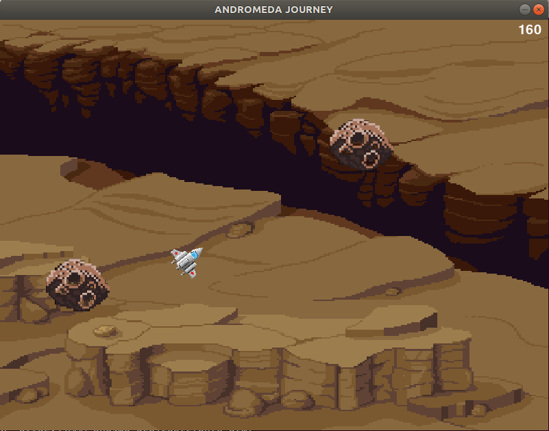

# PyGames Portfolio
PyGames repository created to practice python programming language by making simple games.

- ### Andromeda Journey: 

  - __Rules__
    - A multi-level arcade flying game where you must blow up meteorites.
    - Use arrow keys to move across the map.
    - Use space bar to shoot.

- ### Panic! Catch the damn keys!: 
    - __Rules__
		- You are the housekeeper in the palace but the evil ghost has stolen all the keys, catch all the keys until dawn comes.
		- Use mouse to catch them all.

- ### Black Jack: 

  - __Rules__
  	- Blackjack may be played with one to eight decks of 52-card decks.
  	- Aces may be counted as 1 or 11 points, 2 to 9 according to pip value, and tens and face cards count as ten points.
  	- The value of a hand is the sum of the point values of the individual cards. Except, a "blackjack" is the highest hand, consisting of an ace and any 10-point card, and it outranks all other 21-point hands.
  	- After the players have bet, the dealer will give two cards to each player and two cards to himself. One of the dealer cards is dealt face up. The facedown card is called the "hole card."
